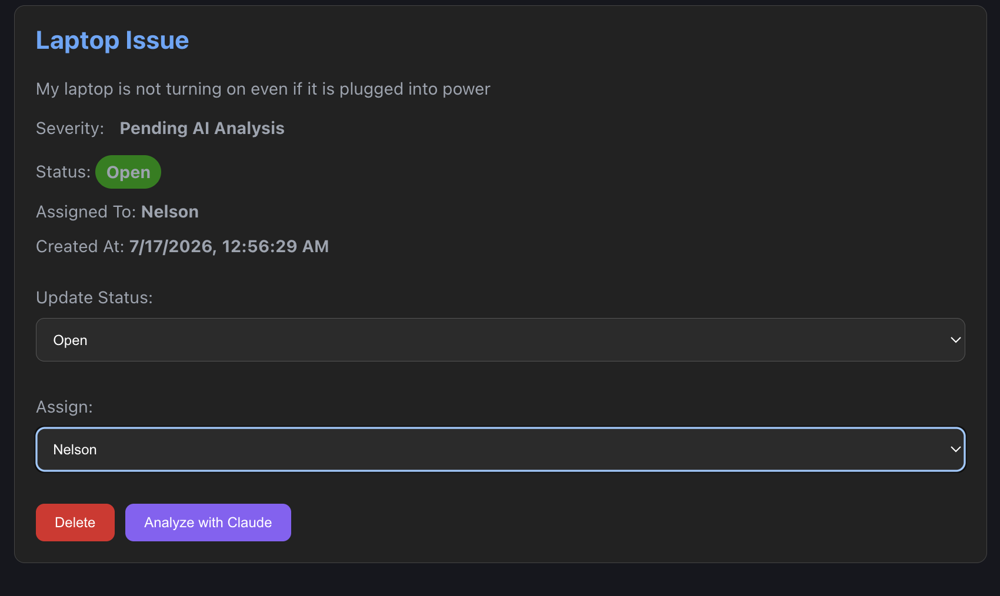
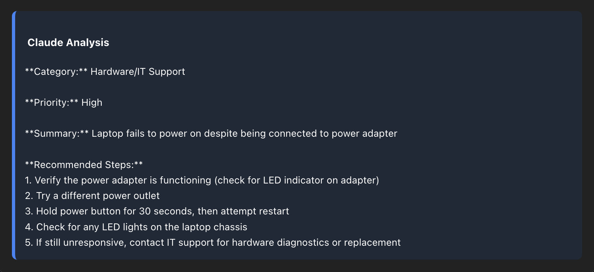
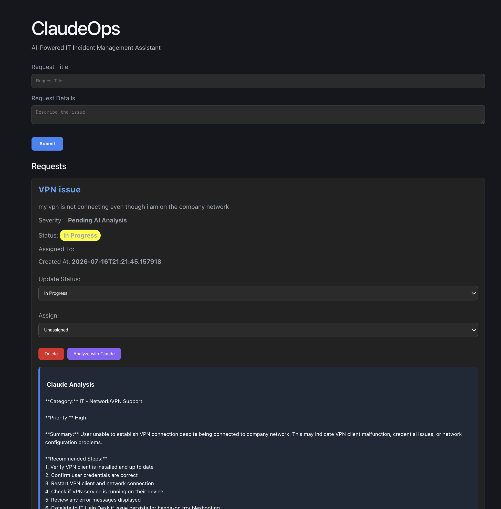

# ClaudeOps


> AI-powered incident management platform built with React, FastAPI, SQLAlchemy, SQLite, and Anthropic Claude.

ClaudeOps is a full-stack incident management platform that combines traditional IT ticket management with AI-assisted workflows. It enables users to create and manage support tickets while leveraging Anthropic's Claude API to generate technical summaries, recommend troubleshooting steps, and assist with incident categorization and prioritization.

Rather than replacing IT professionals, ClaudeOps demonstrates how large language models can augment existing workflows by reducing repetitive work, improving consistency, and helping teams resolve incidents more efficiently.

## Table of Contents

- Overview
- Features
- Architecture
- Tech Stack
- Demo
- Installation
- Environment Variables
- Project Structure
- Why I Built This
- Lessons Learned
- Future Improvements
- Author


## Overview

Organizations often spend significant time responding to repetitive support requests, documenting resolutions, and transferring operational knowledge between team members.

ClaudeOps was inspired by my experience working in enterprise IT support, where much of the troubleshooting process relied on institutional knowledge scattered across documentation, previous tickets, and individual technicians.

This project explores how AI can improve operational workflows by helping support teams:

- Analyze incidents more quickly
- Generate consistent technical summaries
- Recommend troubleshooting steps
- Improve incident documentation
- Keep humans in control of final decisions


## Features

### Ticket Management

- Create IT support tickets
- Update ticket status
- Assign tickets to team members
- Delete existing tickets
- Store ticket data using SQLite and SQLAlchemy

### AI-Assisted Incident Analysis

- Analyze support incidents with Anthropic Claude
- Generate concise technical summaries
- Recommend troubleshooting steps
- Assist with incident categorization
- Assist with incident prioritization

### User Interface

- Responsive React frontend
- Modern dark-themed dashboard
- Asynchronous API requests
- Loading states during AI analysis


## Architecture

```text
                React + TypeScript
                       │
                 REST API Requests
                       │
                 FastAPI Backend
                       │
          SQLAlchemy + SQLite Database
                       │
              Anthropic Claude API
```


## Tech Stack

### Frontend

- React
- TypeScript
- Vite

### Backend

- FastAPI
- Python
- SQLAlchemy
- SQLite

### AI

- Anthropic Claude API
- Prompt Engineering

### Developer Tools

- Git
- GitHub


## Demo

### Dashboard
Create, assign, and manage incidents through a modern React dashboard.



### AI Incident Analysis
Claude generates technical summaries, recommended troubleshooting steps, and suggested categorization.



### Full Page


## Live Demo

Coming Soon

## Installation

### Clone the repository

```bash
git clone https://github.com/stephxsolis/claude-ops-assistant.git

cd claude-ops-assistant
```

### Backend Setup

```bash
cd backend

python -m venv venv

# macOS/Linux
source venv/bin/activate

# Windows
venv\Scripts\activate

pip install -r requirements.txt

uvicorn main:app --reload
```

The backend will start at:

```
http://localhost:8000
```


### Frontend Setup

```bash
cd frontend

npm install

npm run dev
```

The frontend will start at:

```
http://localhost:5173
```


## Environment Variables

Create a `.env` file inside the backend directory.

```env
ANTHROPIC_API_KEY=your_api_key_here
```


## Project Structure

```
ClaudeOps
│
├── backend
│   ├── main.py
│   ├── models.py
│   ├── database.py
│   ├── services/
│   └── requirements.txt
│
├── frontend
│   ├── src
│   ├── components
│   └── App.tsx
│
└── README.md
```


## Why I Built This

During my time working in IT support, I noticed that resolving technical issues often depended on institutional knowledge spread across emails, documentation, previous tickets, and individual team members.

I built ClaudeOps to explore how AI could reduce repetitive work while preserving human oversight. Rather than replacing technical staff, the goal is to help organizations respond more consistently, document solutions more effectively, and make operational knowledge easier to share across teams.


## Lessons Learned

Building ClaudeOps strengthened my understanding of:

- Designing RESTful APIs using FastAPI
- Building full-stack applications with React and Python
- Integrating large language models into real-world workflows
- Managing relational databases with SQLAlchemy and SQLite
- Connecting frontend and backend systems through asynchronous API calls
- Designing AI-assisted user experiences that keep humans in the decision-making process


## Future Improvements

- User authentication and role-based access control
- Searchable AI-powered knowledge base
- Multi-organization support
- AI-assisted documentation generation
- Analytics dashboard and reporting
- Email and Slack notifications
- Advanced ticket filtering and search


## Author

**Stephanie Solis**

Computer Science Graduate | Full-Stack Software Engineer | AI Applications

- LinkedIn: https://www.linkedin.com/in/stephanieesolis/
- GitHub: https://github.com/stephxsolis