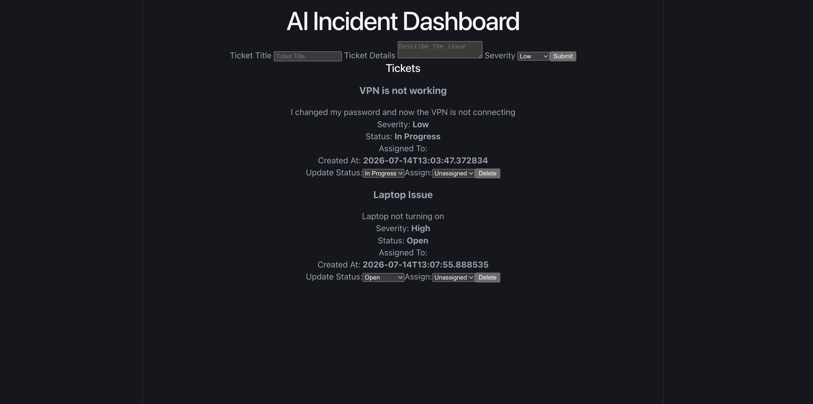

#AI Incident Dashboard

An AI-powered IT incident management dashboard that automatically analyzes user-submitted tickets, categorizes issues, generates summaries, and provides recommendations for troubleshooting

The goal of this project is to explore how AI can improve IT support workflows by reducing manual ticket triage and helping technicians resolve incidents faster.

## Featurs

### Ticket Management
- Create IT incident tickets
- View all submitted tickets
- Update ticket status
- Assign tickets to technicians
- Delete tickets

### AI-Powered Analysis
- Automatically categorizes incidents
- Generates ticket summaries
- Provides recommended troublshooting steps
- Provides AI confidence scoring

### Database 
- Persistent ticket storage using SQLite
- SQLAlchemy ORM for database management

## Tech Stack

### Frontend
- React
- Typescript
- Vite

### Backend
- FastAPI
- Python
- SQLAlchemy
- Pydantic

### Database
- SQLite

### AI
- Modular AI analysis service
- Current implementation uses rule-based classification
- Claude API integration planned

## Architecture
User
|
v
React Dashboard
|
v
FastAPI Backend
|
v
+--> SQLite Database
|
v
Incident Dashboard

## Example Workflow

1. User submits an IT issue:
  > "I changed my password and now my VPN is not connecting."

2. Backend sends the ticket to the AI analysis service

3. AI gereates:
  - Caregory: Network
  - Summary: VPN connectivity issue detected
  - Recommended steps:
    - Clear saved VPN client
    - Verify account permissions

4. Ticket is stored in the database and displayed on the dashboard.

## Future Improvements

- Replace rule-based AI analysis with Claude API
- Add authentication
- Add technician/user roles
- Add AI chatbot for troubleshooting
- Add ticket history and analytics

## Running locally

### Backend

Create virtual environment:

```bash
python -m venv venv
source venv/bin/activate

# Install dependencies
pip install -r requirements.txt

# Run FastAPI
uvicorn main:app --reload
```
### Frontend
```bash
# Install dependencies
npm install

# Run development server
npm run dev
```

### Demo


